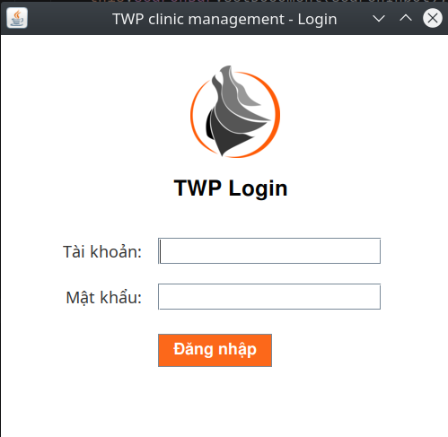
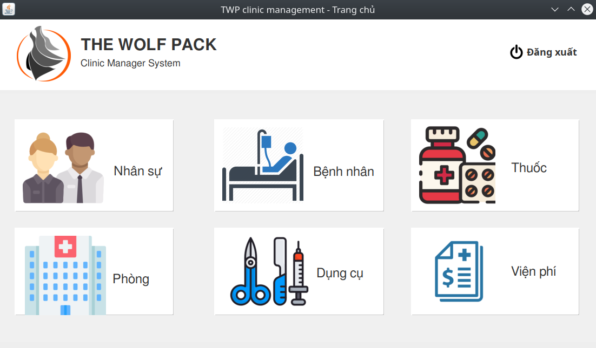
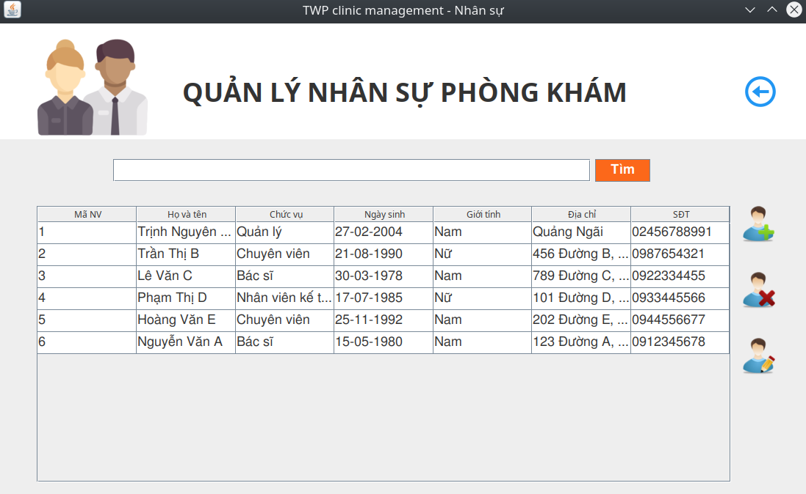
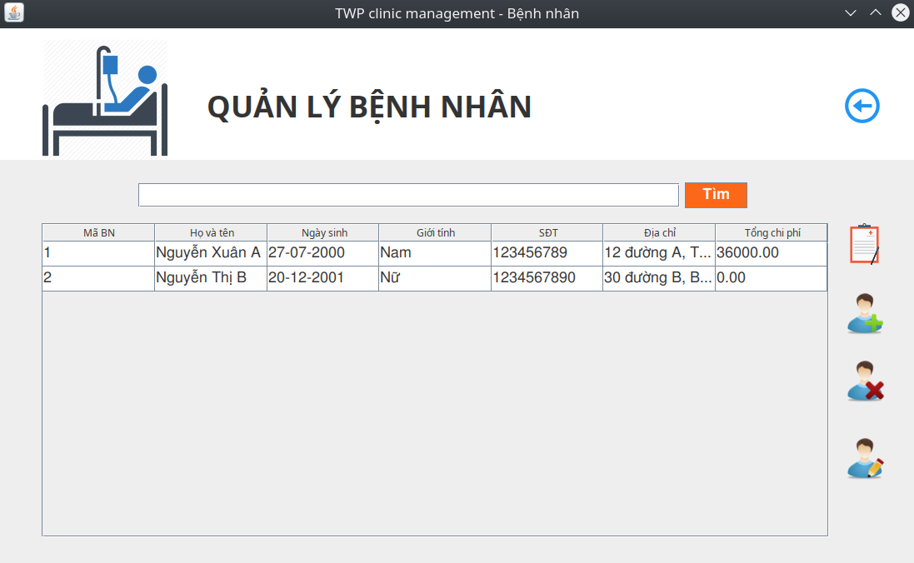
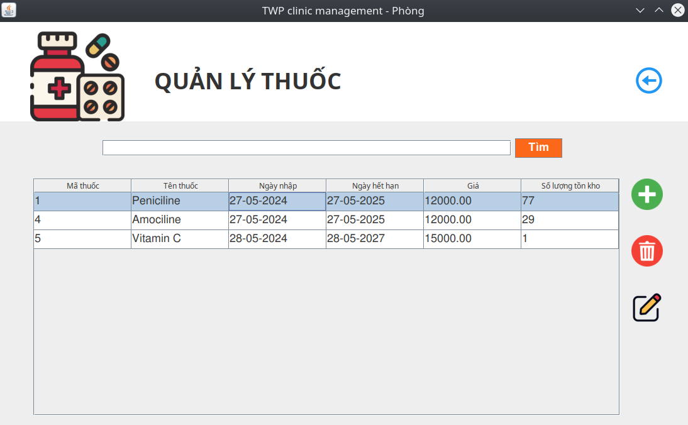
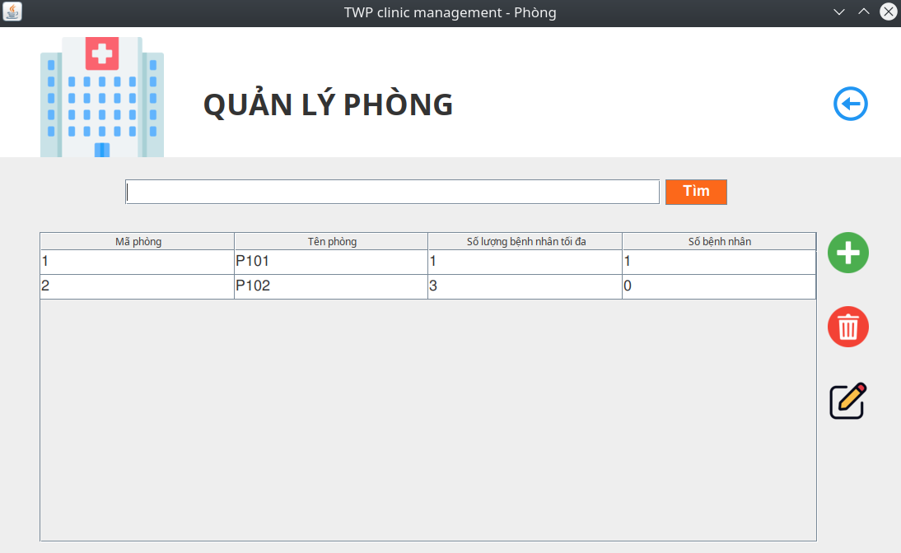
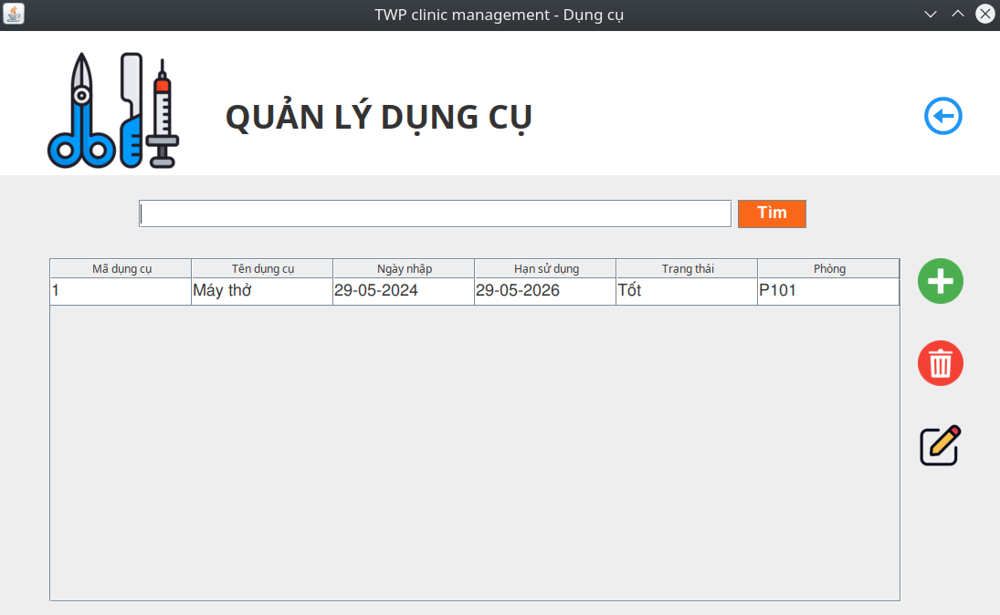
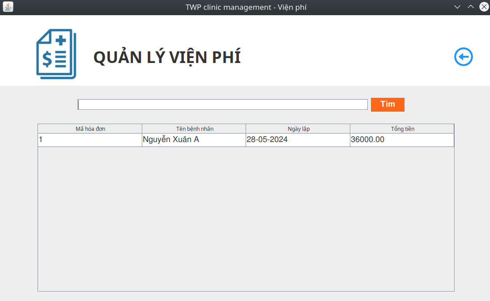

# PHẦN MỀM QUẢN LÝ PHÒNG KHÁM
## Lời cảm ơn
Lời đầu tiên, chúng em xin gửi lời cảm ơn chân thành đến thầy cô Khoa Hệ thống thông tin đã tạo điều kiện cho chúng em được tìm hiểu và học về môn Hệ quản trị cơ sở dữ liệu. Trong quá trình học tập, chúng em đã có được rất nhiều kiến thức và kinh nghiệm liên quan đến các vấn đề trong môn học. Đặc biệt, chúng em xin gửi lời cảm ơn sâu sắc nhất đến thầy, cô giảng dạy lý thuyết và thực hành đã trực tiếp hướng dẫn, định hướng chuyên môn, giúp đỡ tận tình đề tài đồ án của nhóm chúng em và tạo mọi điều kiện thuận lợi như việc đóng góp và chia sẻ tài liệu rất chất lượng.  
Dựa trên những kiến thức thầy cô cung cấp cùng với sự tìm tòi, học hỏi thêm từ nhiều nguồn khác nhau nhóm dã hoàn thành đồ án với những sự cố gắng và nỗ lực nhất. Tuy nhiên do lần đầu thực hiện nên khó tránh khỏi những sai sót. Nhóm rất mong nhận được sự đóng góp ý kiến của thầy, cô để có thể rút ra được những kinh nghiệm và thực hiện tốt hơn trong các đồ án tiếp theo.
## Giới thiệu
Các phòng khám y tế ngày càng phát triển và mở rộng, việc quản lý hiệu quả các hoạt động trong phòng khám trở nên cần thiết hơn bao giờ hết. Việc áp dụng công nghệ thông tin vào quản lý phòng khám không chỉ giúp cải thiện hiệu suất làm việc mà còn nâng cao chất lượng dịch vụ chăm sóc sức khỏe. Đồng thời, với sự phát triển mạnh mẽ của công nghệ hiện nay, việc xây dựng một phần mềm quản lý phòng khám hiệu quả và tiện lợi là hoàn toàn khả thi và cần thiết. Đây cũng là cơ hội để chúng em áp dụng những kiến thức đã học vào thực tế, đồng thời cũng là cơ hội để chúng em học hỏi và nâng cao kỹ năng lập trình của mình.
## Mục tiêu dự án
Mục tiêu chung:
Phát triển một hệ thống quản lý phòng khám hiệu quả, giúp phòng khám X nâng cao khả năng quản lý thông tin bệnh nhân, nhân sự, lịch khám, thuốc, viện phí, bệnh án và các tài nguyên khác một cách chính xác và thuận tiện.
Mục tiêu cụ thể:
Cải thiện quy trình quản lý thông tin bệnh nhân:
-	Lưu trữ và truy xuất thông tin bệnh nhân một cách nhanh chóng và chính xác.
-	Giảm thiểu sai sót trong việc quản lý hồ sơ bệnh nhân.
     Nâng cao hiệu quả quản lý lịch khám:
-	Quản lý đặt lịch khám và lịch sử khám bệnh của bệnh nhân.
-	Tối ưu hoá lịch làm việc của bác sĩ và nhân sự phòng khám.
     Quản lý thuốc và viện phí:
-	Theo dõi thông tin nhập, tồn kho và hạn sử dụng của thuốc.
-	Quản lý hóa đơn viện phí và lịch sử thanh toán của bệnh nhân.
     Hỗ trợ bác sĩ trong việc quản lý bệnh án và kê toa thuốc:
-	Lưu trữ chi tiết bệnh án và các chẩn đoán.
-	Hỗ trợ bác sĩ trong việc kê toa thuốc và theo dõi lịch sử điều trị của bệnh nhân.
     Quản lý nhân sự, phòng và dụng cụ y tế:
-	Quản lý thông tin nhân sự bao gồm thông tin cá nhân, chức vụ và ca trực.
-	Quản lý thông tin các phòng khám và số lượng bệnh nhân tối đa của từng phòng.
-	Quản lý tình trạng và hạn sử dụng của dụng cụ y tế.
     Đảm bảo tính bảo mật và phân quyền người dùng:
-	Mỗi nhân sự sẽ có tài khoản và quyền truy cập phù hợp với chức năng và nhiệm vụ của họ.
-	Đảm bảo an toàn dữ liệu.
     Kết quả mong đợi:
-	Hệ thống quản lý phòng khám hoạt động ổn định, chính xác và dễ sử dụng.
-	Tăng cường hiệu quả làm việc của nhân viên phòng khám.
-	Hệ thống sẵn sàng cho việc mở rộng quy mô phòng khám trong tương lai.
## Ngôn ngữ, công nghệ sử dụng
- Ngôn ngữ lập trình: Java  
- Cơ sở dữ liệu: MySQL  
- GUI: JavaSwing  
- Dependence Injection: Google Guice  
- Công cụ phát triển: NetBeans, Intellij IDEA  
- Quản lí mã nguồn: Github
## Chức năng chính
- Quản lý thông tin bệnh nhân.
- Quản lý thông tin thuốc.
- Quản lý thông tin viện phí.
- Quản lý bệnh án và kê toa thuốc.
- Quản lý nhân sự, phòng và dụng cụ.
- Đăng nhập và phân quyền sử dụng hệ thống.
## Cài đặt
- Bước 1: Tạo database cho ứng dụng (sử dụng cơ sở dữ liệu MySql) bao gồm: Các bảng, procedure và trigger (Script trong folder README). 
- Bước 2: Tải project, kết nối project với cơ sở dữ liệu MySql.
- Bước 3: Thay đổi cấu hình cơ sở dữ liệu trong file config.properties 
- Bước 3: Sử dụng câu lệnh `ThemNhanVien('<1>','Quản lý','<2>','<3>','<4>','<5>','<6>','<7>'); ` để thêm tài khoản với quyền quản lý.  
Trong đó: 
  - `<1>` : Được thay thế bằng họ và tên
  - `<2>` : Được thay thế bằng ngày sinh (định dạng yyyy-MM-dd)
  - `<3>` : Được thay thế bằng giới tính (Nam hoặc Nữ)
  - `<4>` : Được thay thế bằng địa chỉ
  - `<5>` : Được thay thế bằng số điện thoại
  - `<6>` : Được thay thế bằng tài khoản
  - `<7>` : Được thay thế bằng mật khẩu
- Bước 3: Khởi chạy project, đăng nhập với tên tài khoản và mật khẩu vừa tạo.
## Giao diện chính
### Đăng nhập

### Trang chính

### Các trang quản lý
 
 
 
 
 
 

